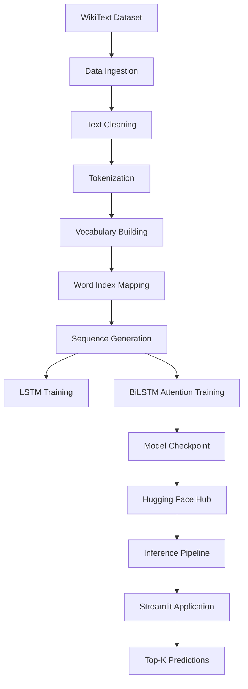

# 🚀 Next Word Prediction using BiLSTM + Attention

## Overview

This project implements an end-to-end Next Word Prediction system using Deep Learning and Natural Language Processing (NLP).

The model learns contextual relationships between words and predicts the most probable next word for a given input sequence.

The complete pipeline includes:

* Data Ingestion
* Text Preprocessing
* Vocabulary Construction
* Sequence Generation
* LSTM Baseline
* BiLSTM + Attention Model
* Model Training
* Inference Pipeline
* Streamlit Deployment
* Hugging Face Model Hosting

---

## Live Demo

Streamlit Application:

https://next-word-prediction-6fkq7ta6mj57arbfoyrsrg.streamlit.app/

---

## Problem Statement

Given a sequence of words:

Input:

```text
machine learning is
```

Output:

```text
another
a
filmed
my
an
```

The model predicts the most probable next word based on learned language patterns.

---

## Dataset

Dataset: WikiText Corpus

Total Tokens:

* 2 Million+ Tokens

Vocabulary Size:

* 39,275 Words

Training Samples:

* 2,051,905 Sequences

---

## Model Architectures

### Baseline Model

LSTM

### Advanced Model

BiLSTM + Attention

Advantages:

* Captures left context
* Captures right context
* Attention focuses on important words
* Better contextual understanding

---

## Project Structure

```text
next-word-prediction/

├── app/
├── artifacts/
├── notebooks/
├── src/
├── requirements.txt
├── README.md
└── .gitignore
```

---

## Results

### LSTM

Final Loss:

1.52

### BiLSTM + Attention

Final Loss:

1.13

Improvement:

~26% reduction in training loss

---

## Deployment

Frontend:

* Streamlit

Model Storage:

* Hugging Face Hub

Backend:

* PyTorch

---

## Technologies Used

Python

PyTorch

NumPy

Pandas

Matplotlib

Streamlit

Hugging Face Hub

Git

GitHub

---

## Future Improvements

* Beam Search Decoding
* Transformer Decoder
* GPT-style Language Modeling
* ONNX Optimization
* Docker Deployment
* CI/CD Pipeline

---

## Author

Devashish Shankar

LinkedIn:
https://www.linkedin.com/in/devashish-shankar-a6214a20a/

GitHub:
https://github.com/Devashish-Shankar


## Architecture




## Folder Documentation

### app/

Contains Streamlit frontend application.

Files:

- app.py
- predictor.py

---

### artifacts/

Stores deployment assets.

#### artifacts/model/

Contains trained model.

#### artifacts/vocab/

Contains vocabulary object.

Files:

- vocab.pkl

---

### notebooks/

Project development notebooks.

| Notebook | Purpose |
|-----------|----------|
| 01_EDA | Dataset Analysis |
| 02_Preprocessing | Cleaning & Vocabulary |
| 03_Model_Training | LSTM Training |
| 04_Inference | LSTM Prediction |
| 05_BiLSTM_Training | Advanced Training |
| 06_BiLSTM_Inference | Advanced Prediction |

---

### src/config/

Centralized configuration.

Files:

- config.py

---

### src/data/

Data pipeline modules.

Files:

- ingestion.py
- loader.py
- preprocess.py
- vocab.py
- sequence_generator.py
- dataset.py
- validator.py

---

### src/models/

Neural network architectures.

Files:

- lstm.py
- bilstm_attention.py

---

### src/training/

Training logic.

Files:

- trainer.py

---

### src/inference/

Inference logic.

Files:

- predict.py
- bilstm_predict.py

---

### src/utils/

Utility functions.

Files:

- download_model.py

---